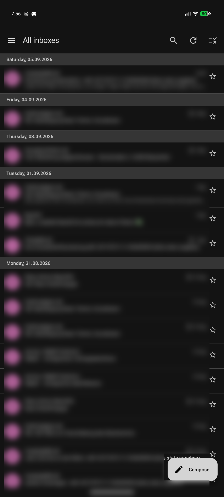
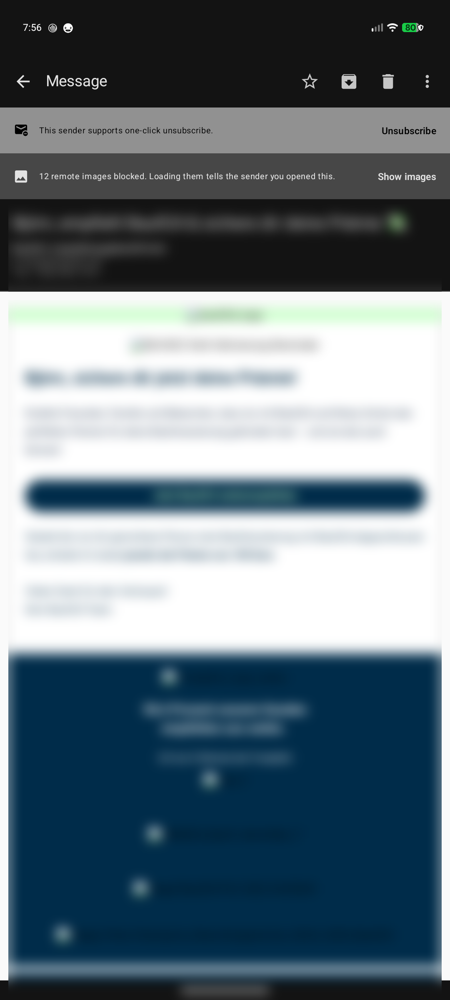
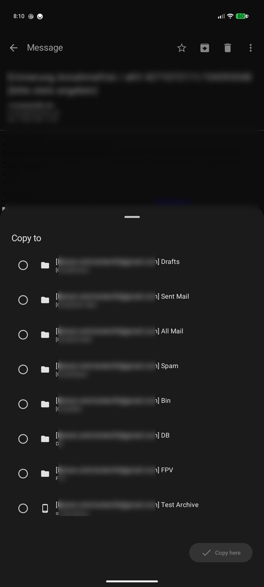
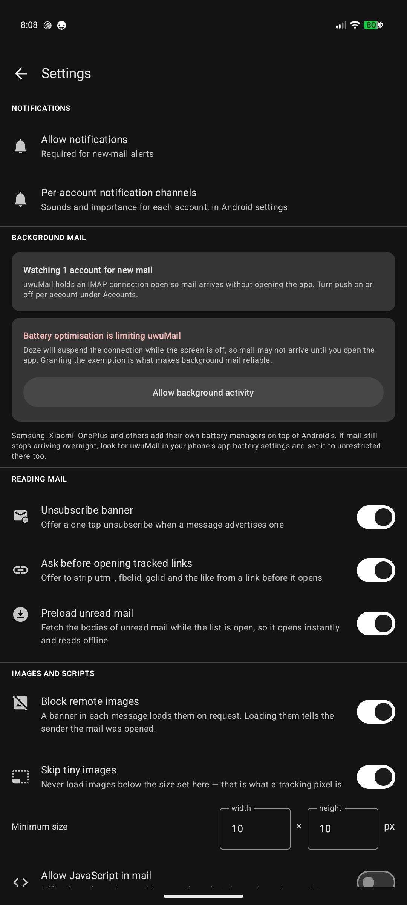
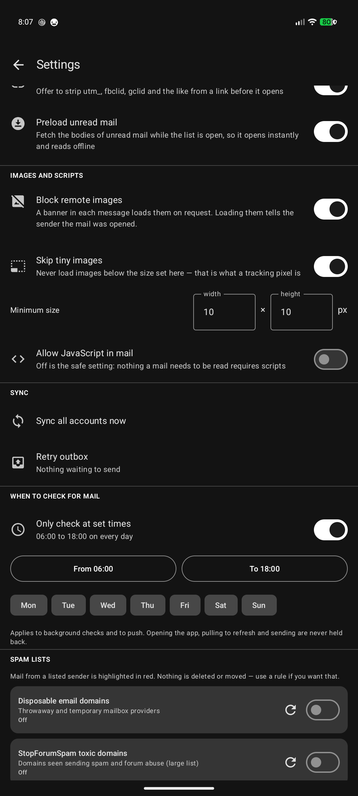

# uwuMail

A multi-account IMAP mail client for Android 12+ (API 31), built around a rules
engine that can act on mail before it ever reaches your notification shade.

<p align="center">
  
  
  
  
</p>

<sup>Sender addresses and subjects are blurred in these screenshots; nothing in
the app is.</sup>

## What it does

**Accounts**
- Any number of IMAP/SMTP accounts, each with its own sync interval, colour and
  notification channels.
- Password or **OAuth2 (XOAUTH2)** authentication per account. Gmail no longer
  accepts account passwords over IMAP, so Google accounts sign in through the
  browser — see [Google sign-in](#google-sign-in) below.
- Server settings are discovered from the domain's autoconfig
  (`autoconfig.<domain>`, `.well-known`, Mozilla's ISPDB) and stay fully editable.
- Passwords are encrypted with a hardware-backed AES-GCM key from the Android
  keystore; only the ciphertext is stored on disk.

**Sending with a custom From**
- The From address in the composer is free text, not a dropdown of your own
  addresses. Type `xyz@mail.de` and that is what goes on the wire — your server
  decides whether to accept it.
- Frequently used addresses can be saved as *identities* per account and picked
  from a menu in the composer, where they can also be deleted. Account settings
  lists them too, and is where you choose which one new messages start from.
  Saving an address that is already saved updates it rather than duplicating it.
- `Envelope sender follows the From address` (per account) controls whether
  `MAIL FROM` tracks the From header or stays on the account address, since some
  servers require one or the other.

**Folders**
- Unified views across every account: **All inboxes**, **All outboxes** (the Sent
  folders) and **All deleted mails**. Pull to refresh in any of them syncs that
  folder across every account, whether or not those folders are set to sync in
  the background.
- Long-press any folder in the drawer to reorder it, hide it on this device,
  mark it all read, or toggle background sync. Hiding leaves the folder
  untouched on the server; the order is per-device and can be reset. Hidden
  folders stay listed in the folder manager, which is where you unhide them.
- Folders that are synced in the background are marked; the rest are not, since
  background sync is off by default for everything but the inbox.
- The inbox always sorts first, then Drafts/Sent/Archive/Spam/Trash, then custom
  folders A-Z, then device folders.
- Create, rename and delete IMAP folders on the server, including nested paths.
- **Device folders**: a local folder that lives only on the phone. Moving mail
  into one downloads the full message as `.eml`, stores it in app storage, and
  deletes the server copy — only once the download has actually landed, so a
  failed fetch cannot lose the mail. Moving a message back out re-uploads it
  via `APPEND`. Copying into one takes a row and an `.eml` of its own, so
  reading or deleting the copy leaves the original alone, and mail can be moved
  between device folders. Rules can move or copy into them too.
- **Move and copy across mailboxes.** The picker lists every account's folders
  as `[address] Folder`, with the mail's own mailbox first — every mailbox has
  an Archive, so the account is the part that tells them apart. IMAP cannot
  copy between servers, so a cross-mailbox move downloads the message whole and
  appends it to the destination; the source copy is removed only once that
  append has been acknowledged, and a message whose source could not be fetched
  stays where it is. The destination folder is synced straight afterwards, so
  the mail shows up where it landed.
- Archive, trash, delete permanently, and save any message as `.eml`.
- Removals are optimistic: the message disappears from the list at once and the
  server catches up in the background. If the server refuses, the message comes
  back and the failure is reported rather than the mail going quietly missing.

**Reading mail**

A mail body is untrusted input that would like to know when it was opened, so
uwuMail starts closed and offers to open up. Everything here is a setting, and
each one starts where it is described.

- **Unsubscribe banner** (on). When a message says how to unsubscribe, a strip
  above it does it in one tap. `List-Unsubscribe` is the authority and its
  HTTPS entry beats its `mailto:` entry; senders that skip the header almost
  always still put a link in the body, so that is scanned as a fallback in
  English, German, French, Spanish, Portuguese, Italian, Dutch and Swedish.
  A one-click sender (RFC 8058) is named as one.
- **Ask before opening tracked links** (on). Links in a body always leave for
  the browser rather than navigating inside the message. One carrying `utm_*`,
  `fbclid`, `gclid`, `mc_eid`, `mkt_tok` and the like first offers to open a
  cleaned copy of itself; both answers open the link, the question is only
  which version. Only query parameters are ever removed. Path segments are left
  alone, because senders routinely encode the real destination in the path and
  a broken link is worse than a leaked click.
- **Preload unread mail** (on). While a list is on screen, the bodies of up to
  30 unread messages are fetched in the background, one at a time with a pause
  between them, so opening them is instant and works with no connection.
- **Block remote images** (on). Each message says how many remote images it is
  holding back and loads them on request, for that one viewing — reopening the
  message blocks them again.
- **Skip tiny images** (on, 10x10). An image smaller than this in either
  dimension is never shown: that is what a tracking pixel is, and a 1x600
  spacer reports an open just as reliably as a 1x1. uwuMail fetches the image
  itself to measure it, which also keeps the request out of the WebView's
  cookie store and sends no referrer, and refuses anything that is not an image
  so a body cannot fetch a remote stylesheet or font either. An image the
  decoder cannot measure, such as SVG, is always shown.
- **JavaScript** (off). Nothing a mail needs to be read requires scripts.

**Rules**
Each rule is a set of conditions plus a set of actions.

*Conditions* match on From address, From display name, To/Cc, subject, body text,
any raw header, `List-Id`, attachment filename, size, or folder — with the
operators `matches regex`, `contains`, `is exactly`, `starts with`, `ends with`,
`domain is`, `greater/less than`. Every condition can be inverted or made case
sensitive, and conditions combine with all/any.

*Actions*: mark read/unread, star/unstar, archive, move to trash, delete
permanently, move or copy to an IMAP folder, move or copy to a device folder,
download the full message, and the three notification outcomes — **don't
notify**, notify silently, notify with high priority.

Rules run during sync, before any notification is posted, and the server-side
effects are batched per folder. A rule can be scoped to one account and/or one
folder, given a priority, and told to stop later rules from running. Everything a
rule does is written to an activity log you can read on the Rules screen.

**Building a rule without knowing regex**

Select several similar messages in the list and tap the label icon. uwuMail then:

1. Looks for everything those messages share — identical sender, shared sender
   domain, headers present in all of them with the same or overlapping values
   (this is what catches `X-GitHub-Event`-style mail), common subject prefix,
   suffix or substring, shared recipients.
2. Generalises the subjects into a readable regex when they share structure:
   the longest common token subsequence is kept literal and what varies between
   samples becomes the tightest class the samples justify (`\d+` before
   `[0-9a-fA-F]+` before `\S+` before `.*?`).
3. **Scores every candidate against the rest of your cached mail** and tells you
   how much else it would catch — "matches nothing else in 1,240 cached mails"
   versus "also matches 312 of 1,240".
4. Pre-ticks the smallest combination of conditions that catches your selection
   and nothing else, then lets you adjust it.

You pick the actions, name it, save. The generated rule is a normal rule and can
be opened in the editor afterwards.

The manual rule editor has the same safety net: **Test against cached mail**
reports how many messages the draft would hit before you save it, and
**Apply rules to mail already synced** replays your rules over mail you already
have.

**Spam lists**
- Settings holds a set of public sender blocklists (disposable-mail providers,
  StopForumSpam's toxic domains, FakeFilter) plus any list URL you add and your
  own blocked senders. Lists are plain text, one domain per line.
- Mail from a listed sender is drawn in red in the message list. Nothing is
  deleted, moved or hidden on the strength of a list — the mail is still there
  and the match is visible. Use a rule if you want an action.
- Matching is done in the list query against an indexed sender domain, so
  toggling a list takes effect immediately without rewriting cached mail.

**Message list**
- **Grouped by day.** Every run of mail from one day sits under a heading like
  *Tuesday, 01.09.2026*, pinned to the top of the list while that day is on
  screen, so a long scroll always says how much time it has covered. The
  headings carry the full date rather than *Today* and *Yesterday*: two
  relative labels among absolute ones make that harder to read, not easier.
- New mail lands above what is on screen. If you are already at the top the list
  follows it up so the new message is visible; if you had scrolled down, your
  place is kept and nothing jumps. It also will not move during a fling, in a
  selection, or while you are reading further down.

**Background mail and notifications**
- Push is **on by default**: a foreground service holds an IMAP IDLE connection
  per account, so new mail notifies you without the app being opened. IMAP has
  no push service to delegate to the way FCM-based messengers do, so the app
  holds the connection itself — the same approach Thunderbird and K-9 take.
- The service restarts after a reboot, after an app update, and after being
  killed; it wakes early when the network returns instead of waiting out its
  backoff, and holds a wake lock across the fetch so a sync started during Doze
  is not suspended half-way.
- Periodic WorkManager sync per account runs alongside it as a safety net
  (Android enforces a 15 minute floor) and restarts the service if it died.
- **Settings → Background mail** reports whether the connection is up and offers
  the battery-optimisation exemption. Without that exemption Doze suspends the
  connection while the screen is off, which is the usual reason background mail
  stops arriving. Manufacturer battery managers (Samsung, Xiaomi, OnePlus) sit
  on top of Android's and may need the app marked unrestricted there too.
- **Only check at set times** (off by default). Pick the weekdays and a start
  and stop time — 06:00 to 18:00, say — and unattended checking is confined to
  them. It governs both the periodic worker and the IDLE connection, since
  holding a socket open outside the window would be checking for mail; the
  watcher drops the connection and waits for the window to come round. A window
  whose end is at or before its start reads as spanning midnight, so 22:00-06:00
  means the night, and the part after midnight belongs to the day it opened on.
  Anything you ask for yourself — opening the app, pulling to refresh, sending —
  is never held back.
- One notification channel group per account, with default / silent / high
  channels so rules can downgrade or mute specific mail.

<p align="center">
  
</p>

## Building

Requires JDK 17+ and the Android SDK (compileSdk 35, build-tools 35.0.0). Point
`ANDROID_HOME` at the SDK or set `sdk.dir` in `local.properties`.

```sh
./build.sh                  # signed release APK -> ./uwuMail-release.apk
./build.sh debug            # debug APK -> ./uwuMail-debug.apk
./build.sh --install        # build, then adb install
./build.sh --clean          # clean first
./build.sh release --no-sign
```

`build.sh` finds the SDK from `ANDROID_HOME`, `local.properties` or
`~/Android/Sdk`, picks `./gradlew` (falling back to a `gradle` on `PATH` or a
cached distribution), builds, copies the APK into the project root and reports
the signing certificate.

**Signing.** The first release build generates `keystore/uwumail-release.jks`
and `keystore.properties` with a random password, and Gradle picks them up from
there. Both are gitignored. **Back them up** — Android will not install an
update signed with a different key, so losing the keystore means uninstalling
(and losing local mail) to move forward.

Release is minified and shrunk with R8; the ProGuard rules keep JavaMail whole,
since it resolves providers and content handlers by name at runtime and R8
cannot see those references.

Debug and release share the application id `de.uwumail` but not the signing key,
so a release APK will not install over a debug one. Uninstall first:

```sh
adb uninstall de.uwumail
```

Or drive Gradle directly:

```sh
./gradlew :app:assembleRelease
./gradlew :app:testDebugUnitTest
```

## Google sign-in

Gmail rejects plain account passwords over IMAP with
`Application-specific password required`. uwuMail handles this with a real OAuth2
sign-in: Settings holds the client id, the account screen has **Sign in with
Google**, and the app refreshes access tokens on its own from then on.

uwuMail ships with no OAuth client id, because Google binds a client to a
specific app package and signing certificate. Register your own once:

1. **console.cloud.google.com** → new project → **APIs & Services → Credentials**
2. **Create credentials → OAuth client ID → Android**
   - Package name: `de.uwumail`
   - SHA-1: shown in uwuMail under **Settings → Google sign-in** (tap to copy),
     and printed by `build.sh` after each build. Debug and release are signed
     with different keys and so have different fingerprints — add both to the
     OAuth client if you use both builds.
3. **OAuth consent screen** → External → add the scope
   `https://mail.google.com/` and add your own address as a test user
4. Paste the client id into **Settings → Google sign-in**, or put it in
   `local.properties` so it is compiled in:

   ```properties
   google.oauth.client.id=xxxxxxxx.apps.googleusercontent.com
   ```

Then open **Accounts → + → Sign in with Google**. Server settings and the address
fill themselves in; no password is stored.

**Keep the consent screen out of "Testing".** Google expires refresh tokens
issued by apps in testing status after 7 days, which means signing in again every
week. Setting the publishing status to *In production* avoids that; the app stays
unverified, so the first sign-in shows a "Google hasn't verified this app" screen
— *Advanced → Go to uwuMail (unsafe)* — and unverified apps using this scope are
capped at 100 users, which is irrelevant for personal use.

**Sending as a custom address will not work through Gmail.** Google rewrites the
From header to the authenticated address unless the alias is registered under
Gmail's "Send mail as". Use your own server for that; Gmail is fine as an account
to read and to run rules against.

## Tests

119 JVM unit tests, run with `./gradlew :app:testDebugUnitTest`:

- `rules/` — the rule engine (scoping, priority, stop-processing, negation,
  invalid regex, copies alongside a move), the regex builder, and the
  similarity suggester, including a GitHub-CI-shaped scenario asserting the
  wizard's recommendation catches the selected mails and none of the sibling
  notifications from the same sender and mailing list.
- `mail/UnsubscribeTest` — `List-Unsubscribe` parsing (HTTPS over `mailto:`,
  one-click, comment text outside the brackets), the body-link fallback in
  several languages, and refusing to follow a `javascript:` href.
- `mail/TrackingParamsTest` — which parameters go and which stay, fragments,
  case, and the path being left alone even when it is obviously a redirect.
- `mail/RemoteImagePolicyTest` — the tracking-pixel threshold in either
  dimension, custom limits, images that could not be measured, and refusing
  anything that is not an image.
- `mail/oauth/` — PKCE challenge derivation against RFC 7636, token response
  parsing, expiry handling, and id_token address extraction.
- `mail/FolderClassifierTest` — INBOX detection across casings and nesting,
  SPECIAL-USE attributes, delimiter handling, and folder ordering.
- `data/settings/SyncWindowTest` — the checking window, including overnight
  windows and which day their small hours belong to.
- `data/repo/BlocklistParserTest` — blocklist line parsing, including the
  entries that must be rejected because they would match everything.
- `ui/` — day grouping of the message list, and `[mailbox] folder` labelling.

## Layout

```
app/src/main/java/de/uwumail/
  core/        enums (fields, operators, actions) and JSON helpers
  data/db/     Room entities, DAOs, database
  data/crypto/ keystore-backed credential storage
  data/settings/ app-wide preferences
  data/repo/   account + identity repository, blocklists, connection testing
  mail/        IMAP client, connection pool, SMTP sender, MIME parsing, autoconfig
  mail/oauth/  OAuth2 + PKCE, token refresh, provider definitions
  rules/       matcher, rule engine, regex builder, similarity suggester
  sync/        sync orchestration, WorkManager, IMAP IDLE service
  notify/      notification channels and posting
  ui/          Compose screens and view models
  di/          hand-rolled dependency container
```

## Notes and limits

- HTML bodies render in a WebView with JavaScript, remote loads and file access
  all disabled — mail is untrusted input. Remote images load only when the
  banner in that message is tapped, and uwuMail fetches them itself so it can
  refuse the ones that are only there to report the open.
- Message moves use `COPY` + `\Deleted` + `UID EXPUNGE`, which every IMAP server
  supports, rather than depending on RFC 6851 `MOVE`.
- Android 15 caps `dataSync` foreground services at 6 hours per day, so push may
  pause on very long uptimes; periodic sync continues regardless and the worker
  restarts the service on its next run.
- The IDLE connection uses a 28 minute socket read timeout, just under the point
  RFC 2177 tells clients to re-issue IDLE and where servers drop it, so a
  half-open socket is noticed without churning the connection.
- Attachments can be sent from files already on disk; the composer does not yet
  have a file picker.
- OAuth2 is implemented for Google. The provider definition in
  `mail/oauth/OAuthModels.kt` is generic, so Microsoft/Outlook would be a matter
  of adding endpoints and scopes, but it is untested.
